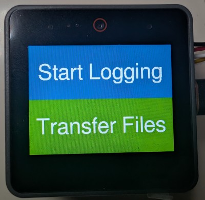
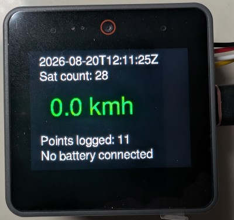

# GPS Logger (M5Stack CoreS3)

A GPS data logger built on the **M5Stack CoreS3** (ESP32-S3) running **CircuitPython**.
It reads NMEA sentences from a **Unicore UM980** GNSS receiver over UART, renders a
live dashboard on the built-in 3.2" TFT display, monitors the battery via the
AXP2101 PMIC, and logs every fix to an SD card as CSV.

**Not yet ready for use**

## Screenshots

| Startup Screen                          | Main Logging Screen      |
|-----------------------------------------|--------------------------|
|  |  |  

*(Yes it's upside down, I drilled holes before checking where the cable had to reach)*


## Features

- Basic Display with time and speed
- Buffered SD card writes (1 Hz data, 10 lines per write)
- Works around M5Stack CoreS3 using the same pin for LCD D/C **and** MISO for SD Card.
- Exposes an HTTP server for getting CSV files off SD Card


## Hardware

| Component     | Details                                                                 |
|---------------|-------------------------------------------------------------------------|
| MCU board     | M5Stack CoreS3 (ESP32-S3)                                               |
| GNSS receiver | Unicore UM980. PortA Grove (TX/RX wiring may be swapped!) @ 115200 baud |
| Storage       | MicroSD card                                                            |
| Firmware      | Adafruit CircuitPython 10.x  (Nightly with SPI fix)                     |


## Project layout

```
.
├── code.py                                   # Main program
├── wifi_config.py                            # Holds SSID/Password
├── lib/
│   ├── axp2101.py                            # AXP2101 PMIC driver (Adafruit)
│   ├── adafruit_focaltouch.mpy               # FT6336U touch driver (Adafruit)
│   ├── adafruit_bitmap_font/                 # Bitmap font loader (Adafruit)
│   ├── adafruit_httpserver/                  # HTTP Webserver
│   └── font_free_sans_{18,24,30,36,42,48}/   # FreeSans PCF bitmap fonts
└── sd/
    └── placeholder.txt   # Required for mount point
```


## GPS configuration

The receiver is configured at every boot via UART commands:

```
unlogall                     # disable all nmea mesasages
config signalgroup 2         # switch to signal group 2  (GNSS frequency preset)
mode rover                   # rover  (not a base station)
config sbas enable auto      # enable SBAS  (or try to)
config ppp enable auto       # enable PPP  (or try to)
gngga 1                      # log GGA messages  (fix details)
gnrmc 1                      # log RMC message   (speed time & date)
version
```

**Note:** If all messages are enabled, there seems to be an issue with the 
UART keeping up.  Can disable unneeded messages via:


## Log format

Logged to `/sd/[yyyymmdd]_[hhmmss]Z.csv`

```
timestamp,latitude,longitude,altitude,speed,num_satellites,hdop
2026-08-15T14:30:00Z,52.37021,4.89517,12.34,42.65,12,0.9
```

- `timestamp` — UTC, `YYYY-MM-DDTHH:MM:SSZ`
- `latitude`/`longitude` — decimal degrees, 6 decimals
- `altitude` — metres (GGA)
- `speed` — km/h (RMC overground speed, knots × 1.852)
- `num_satellites` — satellite count (GGA)
- `hdop` — horizontal dilution of precision (GGA)

A fix is accepted when `hdop < 100` and `sats > 3`.

**TODO:** Write something to convert these to a GPX file.  (We're not natively
using a GPX because it's pretty space inefficient and not easy to append too).


## Issues

Accessing the SD Card *and* the Display at the same time doesn't seem to be
possible as the Core3S re-used the SPI MISO pin for the DC pin of the LCD.

This probably isn't a big deal if you were writing the code in C, but it
required a workaround for CircuitPython.  The workaround seems okay, but it 
does make the screen redraw when switching between the two devices.

For a logger, I'm prepared to live with this.


## References

- [UM980 configuration commands](https://www.ardusimple.com/how-to-configure-unicore-um980-um981-um982/#Frequently-used-commands)
- [NMEA-0183 GGA message](https://receiverhelp.trimble.com/alloy-gnss/en-us/NMEA-0183messages_GGA.html)
- Fonts from https://github.com/adafruit/circuitpython-fonts


## AI Disclaimer

Code (and bugs) created by a human.

Parts of this readme created by Qwen3.8-27B


## License

MIT
